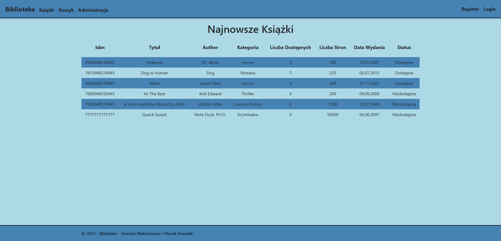
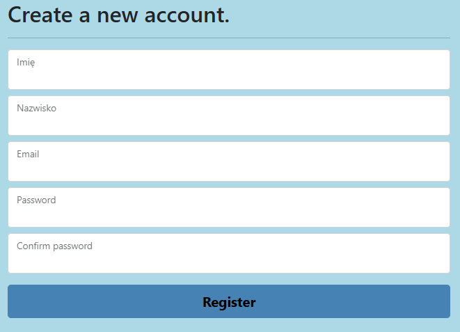
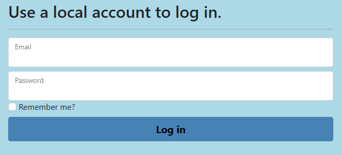
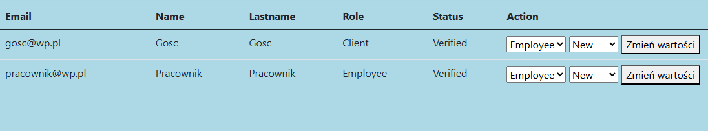
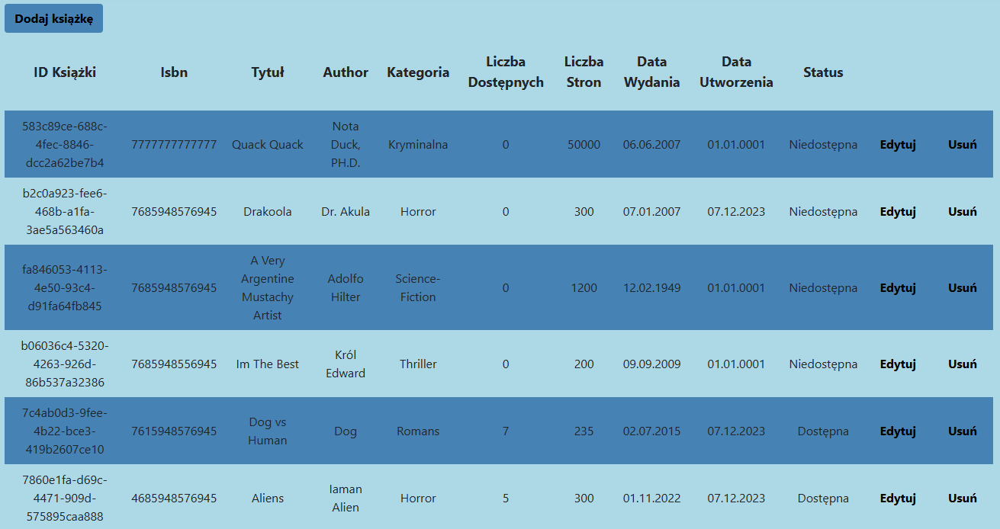

# Introduction
This project is the result of an assignment for a C##/.NET class, developed alongside classmate Damian Maksimowicz.
It centers around a web app built for a hypothetical client - a library or bookseller company looking to engage in e-commerce.
# Usage
The Application's primary function is to display product information stored in a local database, providing the user with the necessary tools to find what they are looking for.
The default view is a home screen entirely dedicated to a list of newly added books, both in and out of stock at the moment.

As this project was focused on functionality, no attention was placed creating a realistic design for the client, leaving a more-or-less barebones view.
As seen on the screenshot, there are 4 primary pages: Biblioteka (the home page), Książki (the search/shop tab), Koszyk (basket view to finalize any purchase/loan) and Administracja (account/page management).
Additionally there exists an option to register or login.
### Authentication and Account Management
This website utilizes an ordinary authentication feature using logging in through a combination of e-mail and password.

The user account includes personal detail in the form of given name and surname, an e-mail address, and a custom password, spelled out twice for additional awareness and to prevent input errors.
The password is securely stored as a hash, while the rest is retained in plain text.
Using this information the user can login through the next view.

After the user is logged in they have access to several new options, including account management.

This enables the input of a phone number, changing any previously given component of the user data or enabling 2FA (Two-Factor Authentication).
They also gain access to several options in the Administracja view, given their account has the requisite priveledges.

User permissions are given in 3 tiers: client, employee and admin. These have a range of available actions, such as changing the permissions of other accounts (available to admins). 
The users who have employee-level access can also perform edits to the local database of books, adding, modifying or removing them at will. 

As seen here, the access level unlocks special interactions with the book view.
### 
